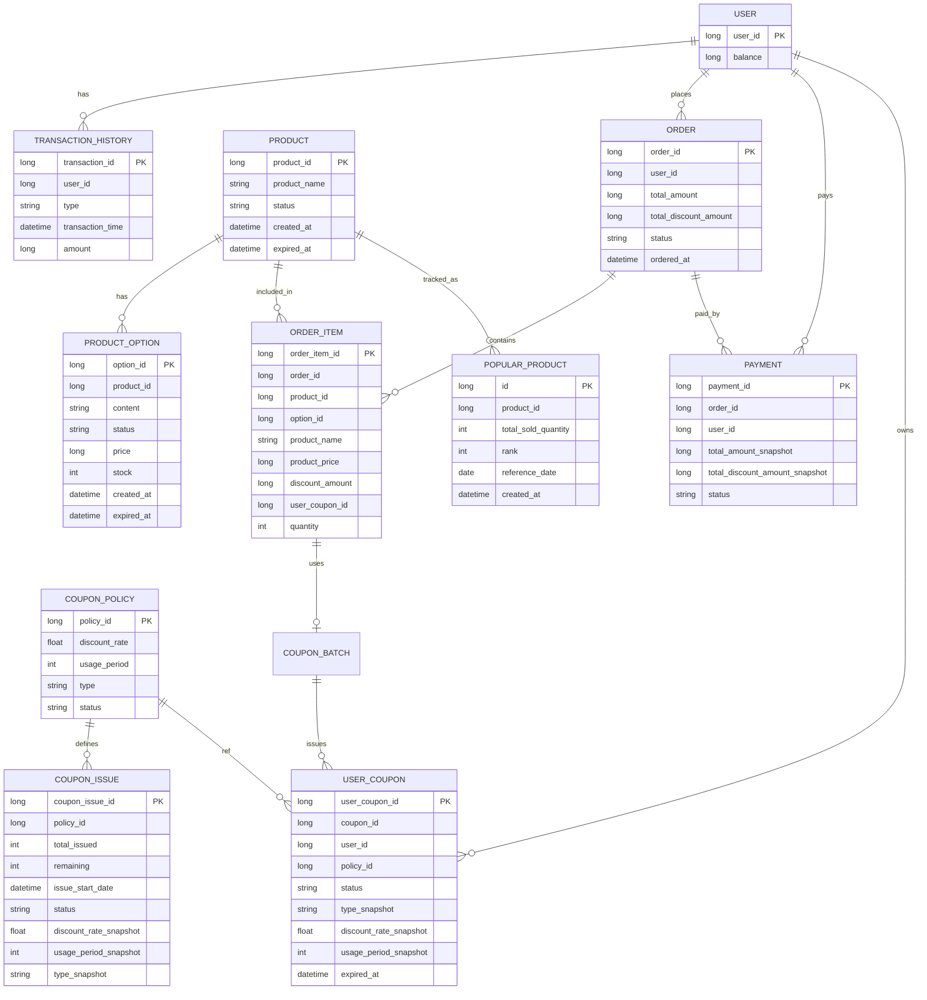

```mermaid
erDiagram

    USER {
        long user_id PK
        long balance
    }

    TRANSACTION_HISTORY {
        long transaction_id PK
        long user_id
        string type
        datetime transaction_time
        long amount
    }

    PRODUCT {
        %% nullable: expired_at
        long product_id PK
        string product_name
        string status
        datetime created_at
        datetime expired_at
    }

    PRODUCT_OPTION {
        long option_id PK
        long product_id
        string content
        string status
        long price
        int stock
        datetime created_at
        datetime expired_at
    }

    ORDER {
        long order_id PK
        long user_id
        long total_amount
        long total_discount_amount
        string status
        datetime ordered_at
    }

    ORDER_ITEM {
        long order_item_id PK
        long order_id
        long product_id
        long option_id
        string product_name
        long product_price
        long discount_amount
        long user_coupon_id
        int quantity
    }

    PAYMENT {
        long payment_id PK
        long order_id
        long user_id
        long total_amount_snapshot
        long total_discount_amount_snapshot
        string status
    }

    COUPON_POLICY {
        %% nullable: discount_rate, discount_amount, minimum_order_amount
        long policy_id PK
        float discount_rate
        int usage_period
        string type
        string status
    }

    COUPON_ISSUE {
        long coupon_issue_id PK
        long policy_id
        int total_issued
        int remaining
        datetime issue_start_date
        string status
        float discount_rate_snapshot
        int usage_period_snapshot
        string type_snapshot
    }

    USER_COUPON {
        long user_coupon_id PK
        long coupon_id
        long user_id
        long policy_id
        string status
        string type_snapshot
        float discount_rate_snapshot
        int usage_period_snapshot
        datetime expired_at
    }

    POPULAR_PRODUCT {
        long id PK
        long product_id
        int total_sold_quantity
        int rank
        date reference_date
        datetime created_at
    }

    %% 관계 정의

    USER ||--o{ TRANSACTION_HISTORY : has
    USER ||--o{ ORDER : places
    USER ||--o{ PAYMENT : pays
    USER ||--o{ USER_COUPON : owns

    PRODUCT ||--o{ PRODUCT_OPTION : has
    PRODUCT ||--o{ ORDER_ITEM : included_in
    PRODUCT ||--o{ POPULAR_PRODUCT : tracked_as

    ORDER ||--o{ ORDER_ITEM : contains
    ORDER ||--o{ PAYMENT : paid_by

    ORDER_ITEM ||--o| COUPON_BATCH : uses

    COUPON_POLICY ||--o{ COUPON_ISSUE : defines
    COUPON_BATCH ||--o{ USER_COUPON : issues
    COUPON_POLICY ||--o{ USER_COUPON : ref
```