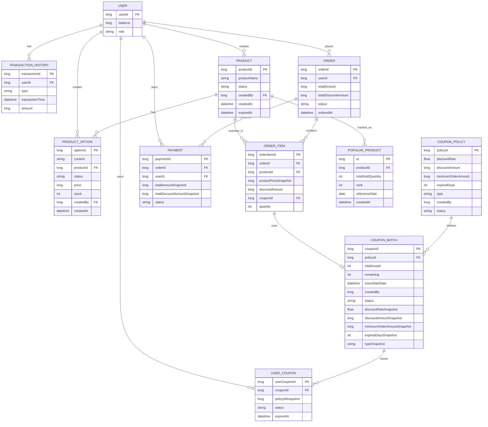

```mermaid
erDiagram

    USER {
        long userId PK
        long balance
        string role
    }

    TRANSACTION_HISTORY {
        long transactionId PK
        long userId FK
        string type
        datetime transactionTime
        long amount
    }

    PRODUCT {
        %% nullable: expiredAt
        long productId PK
        string productName
        string status
        long createdBy FK
        datetime createdAt
        datetime expiredAt
    }

    PRODUCT_OPTION {
        long optionId PK
        string content
        long productId FK
        string status
        long price
        int stock
        long createdBy FK
        datetime createdAt
    }

    ORDER {
        long orderId PK
        long userId FK
        long totalAmount
        long totalDiscountAmount
        string status
        datetime orderedAt
    }

    ORDER_ITEM {
        long orderItemId PK
        long orderId FK
        long productId FK
        long productPriceSnapshot
        long discountAmount
        long couponId FK
        int quantity
    }

    PAYMENT {
        long paymentId PK
        long orderId FK
        long userId FK
        long totalAmountSnapshot
        long totalDiscountAmountSnapshot
        string status
    }

    COUPON_POLICY {
        %% nullable: discountRate, discountAmount, minimumOrderAmount
        long policyId PK
        float discountRate
        long discountAmount
        long minimumOrderAmount
        int expiredDays
        string type
        long createdBy
        string status
    }

    COUPON_BATCH {
        long couponId PK
        long policyId FK
        int totalIssued
        int remaining
        datetime issueStartDate
        long createdBy
        string status
        float discountRateSnapshot
        long discountAmountSnapshot
        long minimumOrderAmountSnapshot
        int expiredDaysSnapshot
        string typeSnapshot
    }
    USER_COUPON {
        long userCouponId PK
        long couponId FK
        long policyIdSnapshot
        string status
        datetime expiredAt
    }

    POPULAR_PRODUCT {
        long id PK
        long productId FK
        int totalSoldQuantity
        int rank
        date referenceDate
        datetime createdAt
    }

    %% 관계 정의

    USER ||--o{ TRANSACTION_HISTORY : has
    USER ||--o{ ORDER : places
    USER ||--o{ PAYMENT : pays
    USER ||--o{ USER_COUPON : owns
    USER ||--o{ PRODUCT : creates
    USER ||--o{ PRODUCT_OPTION : creates

    PRODUCT ||--o{ PRODUCT_OPTION : has
    PRODUCT ||--o{ ORDER_ITEM : included_in
    PRODUCT ||--o{ POPULAR_PRODUCT : tracked_as

    ORDER ||--o{ ORDER_ITEM : contains
    ORDER ||--o{ PAYMENT : paid_by

    ORDER_ITEM ||--o| COUPON_BATCH : uses

    COUPON_POLICY ||--o{ COUPON_BATCH : defines
    COUPON_BATCH ||--o{ USER_COUPON : issues
```