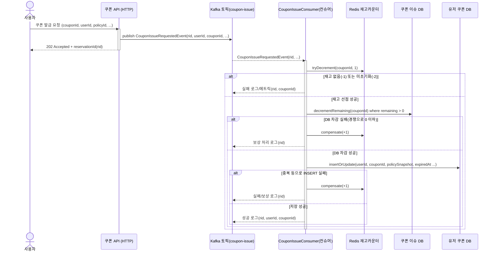
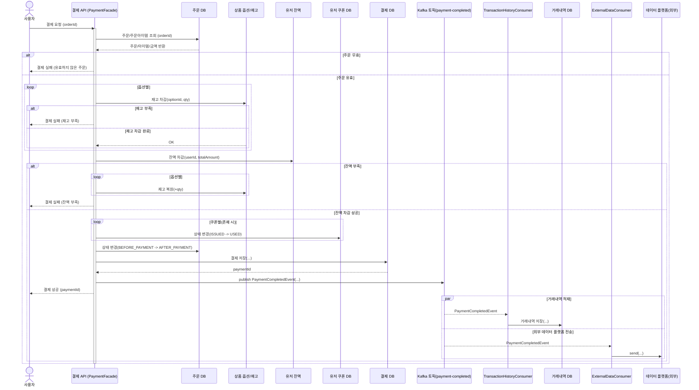

## 리팩토링 배경

현재 쿠폰 발급의 로직은 Redis ZSet으로 Queue를 구성하고 Drain 하는 방식으로 구현되어 있다.
[쿠폰에 Redis 자료 구조 적용하기](https://www.notion.so/Redis-25413a3e1bfc8098a3b6f09a7f1f71f7?pvs=21)

또한 결제 로직은 주요 로직 → 이벤트 발행 → 부가 로직(거래 내역 저장, 외부 데이터 플랫폼에 데이터 전송) 으로 이루어져 있다.

쿠폰 발급에 Kafka를 도입할 경우 순간 트래픽이 많을 것(버스트)으로 예상되는 쿠폰 발급에는 병렬 처리로 인한 처리량 확장과 순서 보장의 안정성이 증가될 것으로 예상된다.

결제 로직에 kafka를 도입할 경우 현재 이미 부가 로직을 비동기로 돌려 동기 로직을 최소환 시킨 상태지만 kafka로 전환하면 외부 플랫폼이 다운되거나 장애 상황에도 토픽이 완충 역할을 하여 핵심 결제 로직을 보호한다.

## 구성 요소

- **Kafka 브로커 × 3**: `confluentinc/cp-kafka:8.0.0` 이미지, 각 노드가 *broker + controller* 역할을 동시에 수행(KRaft)
- **Prometheus + Grafana. Prometheus :** `kafka-exporter:9308`(Kafka Exporter) 등에서 메트릭을 스크랩.

## 네트워킹 & 포트 매핑

| 브로커 | 컨테이너 이름 | EXTERNAL(컨테이너) | 호스트 포트 매핑 | INTERNAL(브로커 간) | CONTROLLER |
| --- | --- | --- | --- | --- | --- |
| 1 | kafka-1 | 0.0.0.0:9092 | localhost:19092 → 9092 | kafka-1:29092 | kafka-1:29093 |
| 2 | kafka-2 | 0.0.0.0:9092 | localhost:29092 → 9092 | kafka-2:29092 | kafka-2:29093 |
| 3 | kafka-3 | 0.0.0.0:9092 | localhost:39092 → 9092 | kafka-3:29092 | kafka-3:29093 |

## Spring Boot 애플리케이션 설정

```r
spring:
application:
name: hhplus
datasource:
driver-class-name: com.mysql.cj.jdbc.Driver
url: jdbc:mysql://localhost:3306/hhplus?characterEncoding=UTF-8&serverTimezone=UTC&allowPublicKeyRetrieval=true&useSSL=false
username: application
password: application
hikari:
maximum-pool-size: 50
minimum-idle: 10
connection-timeout: 30000
max-lifetime: 60000

jpa:
generate-ddl: true
show-sql: true
hibernate:
ddl-auto: none
properties:
hibernate.timezone.default_storage: NORMALIZE_UTC
hibernate.jdbc.time_zone: UTC
hibernate:
format_sql: true
show_sql: true
use_sql_comments: true

data:
redis:
host: localhost
port: 6379

kafka:
bootstrap-servers: localhost:19092,localhost:29092,localhost:39092
consumer:
group-id: my-group
auto-offset-reset: earliest
key-deserializer: org.apache.kafka.common.serialization.StringDeserializer
value-deserializer: org.apache.kafka.common.serialization.StringDeserializer
producer:
key-serializer: org.apache.kafka.common.serialization.StringSerializer
value-serializer: org.apache.kafka.common.serialization.StringSerializer

popular:
rank:
scheduler-enabled: false
```

## 모니터링

### Prometheus 설정

```r
global:
scrape_interval: 15s

scrape_configs:
- job_name: "prometheus"
static_configs:
- targets: ["prometheus:9090"]

- job_name: "redis"
static_configs:
- targets: ["redis-exporter:9121"]

- job_name: "kafka"
static_configs:
- targets: ["kafka-exporter:9308"]
```

### Prometheus/Grafana Compose 설정

```r
services:
prometheus:
image: prom/prometheus:latest
container_name: prometheus
volumes:
- ./docker/prometheus.yml:/etc/prometheus/prometheus.yml
- prometheus_data:/prometheus
ports: ["9090:9090"]
networks: [monitor]

grafana:
image: grafana/grafana:latest
container_name: grafana
environment:
- GF_SECURITY_ADMIN_USER=admin
- GF_SECURITY_ADMIN_PASSWORD=admin
volumes:
- grafana_data:/var/lib/grafana
ports: ["3000:3000"]
networks: [monitor]
depends_on: [prometheus]

volumes:
prometheus_data:
grafana_data:

networks:
monitor:
driver: bridge
```

## 변경된 시퀀스 다이어그램

쿠폰 발급



결제

