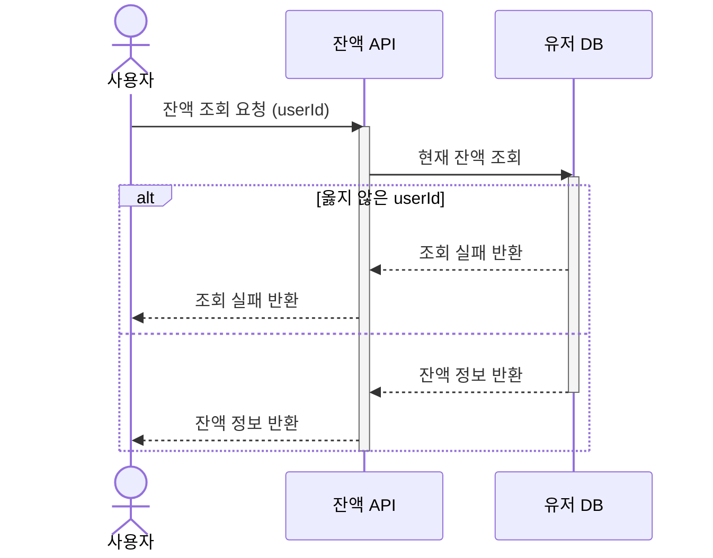
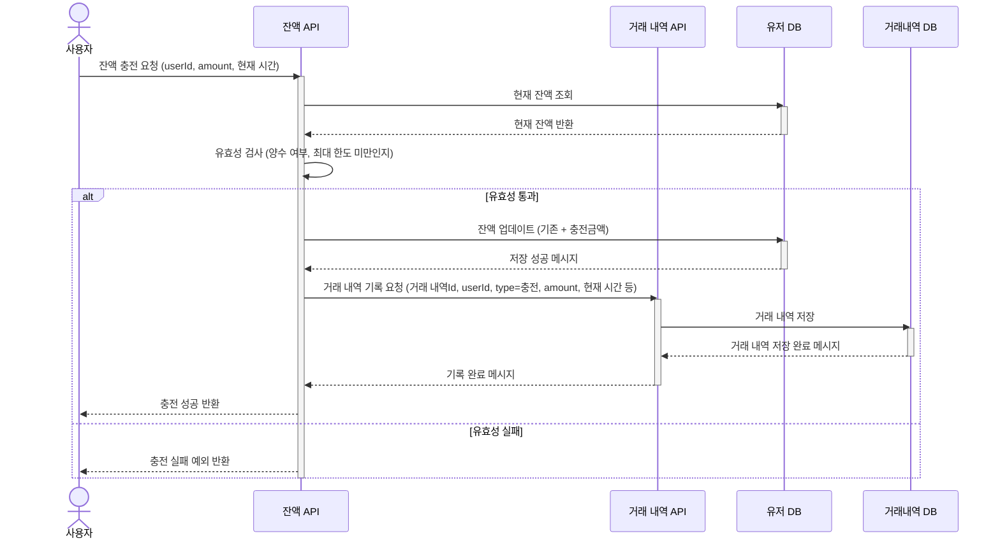
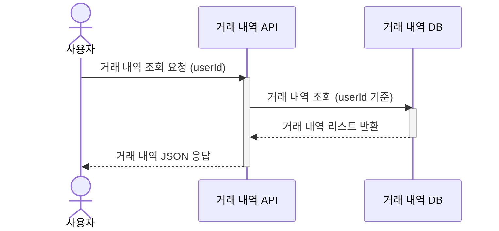
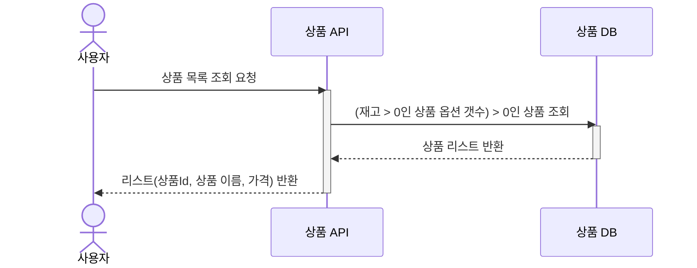
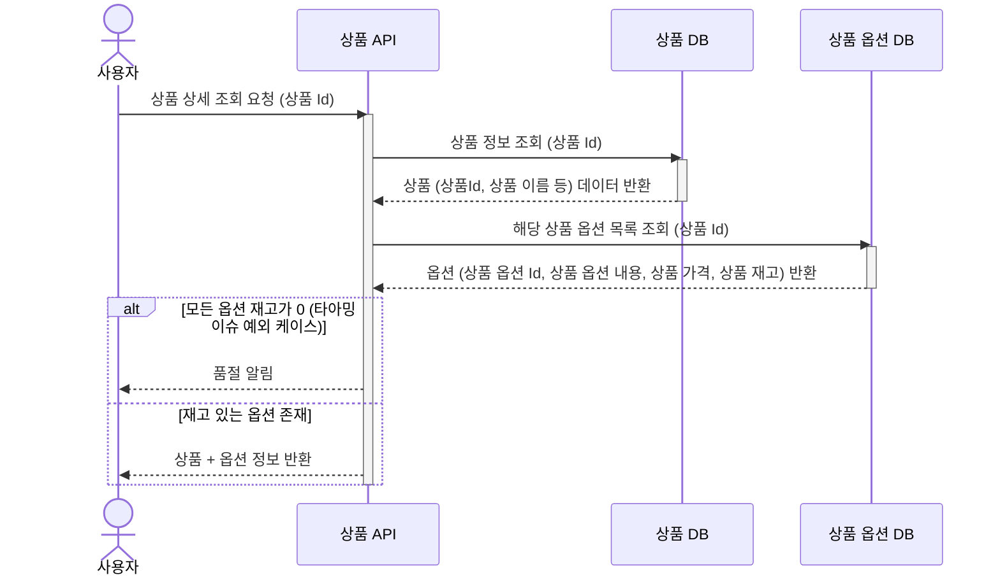
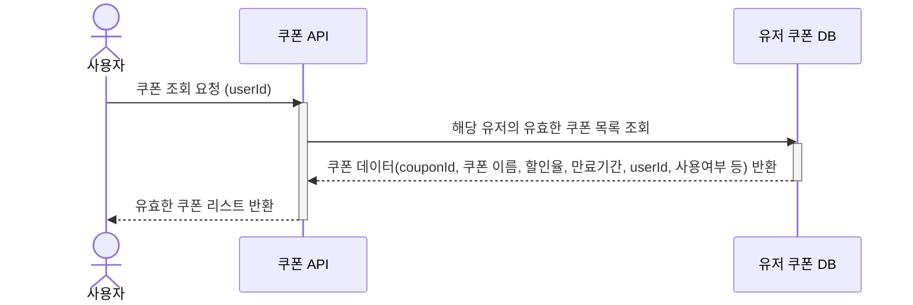
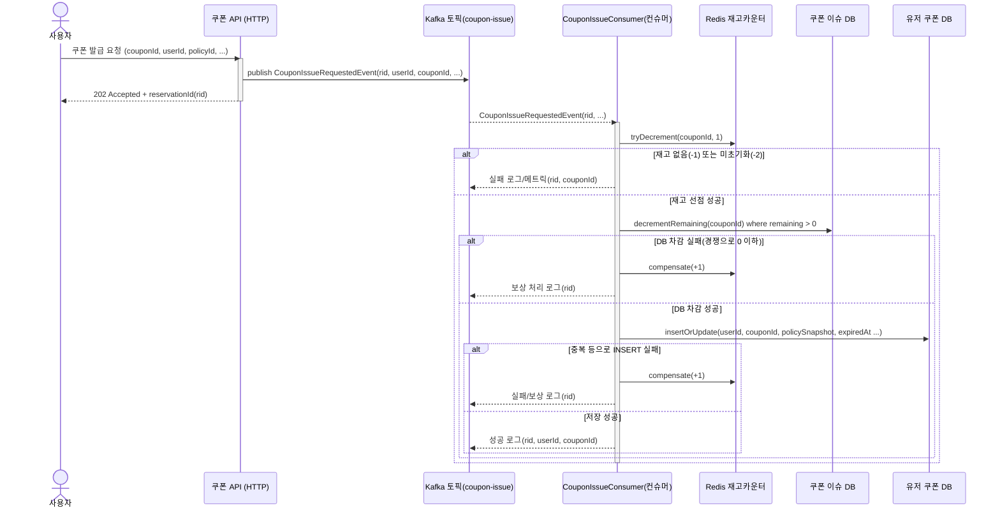
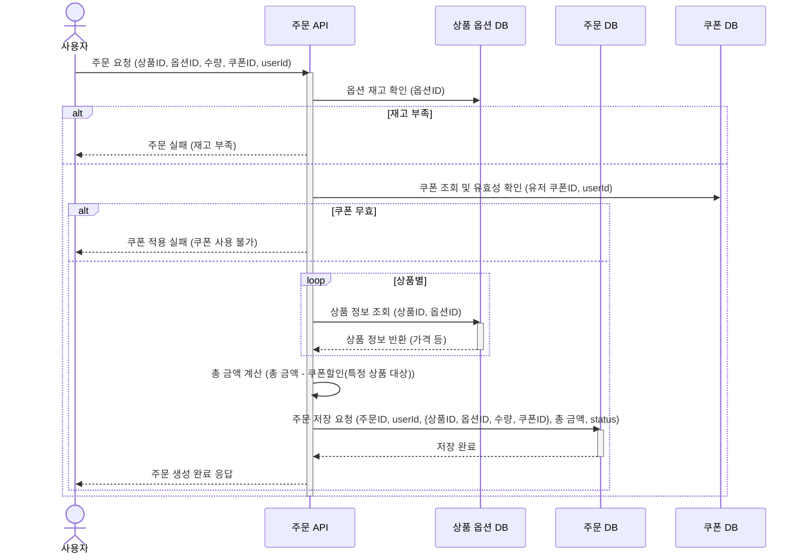
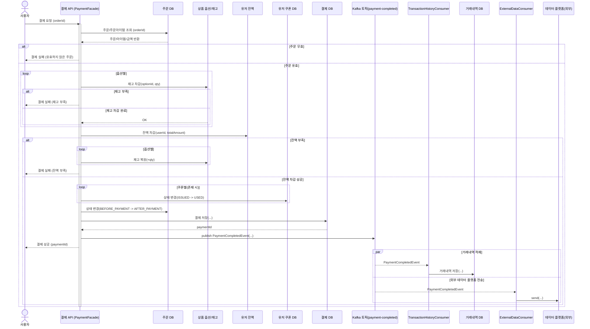
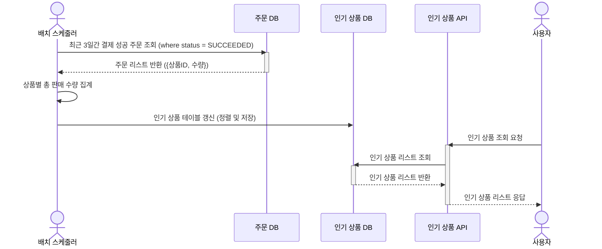

## 목차

---

1. [유저](#유저)
2. [상품](#상품)
3. [쿠폰](#쿠폰)
4. [주문](#주문)
5. [결제](#결제)
6. [인기 상품](#인기-상품)

## 유저

---

1. **잔액 조회**

2. **잔액 충전**

3. **거래 내역 조회**

### 상품

---

1. 상품 목록 조회

1. 상품 상세 조회

### 쿠폰

---

1. 쿠폰 조회

1. 쿠폰 발급

### 주문

---

1. 주문

### 결제

---

1. 결제

### 인기 상품

1. 인기 상품 저장 및 조회

